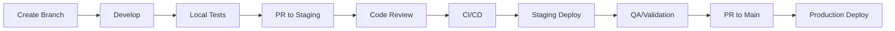

# Development Guide

This document outlines the development workflow, branching strategy, and quality gates for the Arrakis project. The process follows FAANG-level engineering standards.

## Table of Contents

- [Branching Strategy](#branching-strategy)
- [Development Workflow](#development-workflow)
- [Quality Gates](#quality-gates)
- [CI/CD Pipeline](#cicd-pipeline)
- [Environment Strategy](#environment-strategy)
- [Release Process](#release-process)
- [Incident Response](#incident-response)

---

## Branching Strategy

We use a modified GitFlow model optimized for continuous deployment:

```
main (production)
  │
  ├── staging (pre-production validation)
  │     │
  │     └── feature/* (new features)
  │     └── fix/* (bug fixes)
  │
  └── hotfix/* (production emergencies)
```

### Branch Types

| Branch | Purpose | Base | Merges To | Protected |
|--------|---------|------|-----------|-----------|
| `main` | Production code | - | - | Yes |
| `staging` | Pre-production validation | main | main | Yes |
| `feature/*` | New features | staging | staging | No |
| `fix/*` | Non-urgent bug fixes | staging | staging | No |
| `hotfix/*` | Production emergencies | main | main + staging | No |

### Branch Naming Conventions

```bash
# Features
feature/ARK-123-add-wallet-verification
feature/add-rate-limiting

# Bug fixes
fix/ARK-456-cors-header-issue
fix/memory-leak-in-worker

# Hotfixes (production emergencies)
hotfix/ARK-789-critical-auth-bypass
hotfix/emergency-rate-limit-patch
```

### Protection Rules

**main branch:**
- Require pull request reviews (2 reviewers)
- Require status checks to pass (CI + security scan)
- Require signed commits
- No force pushes
- No deletions
- Require linear history

**staging branch:**
- Require pull request reviews (1 reviewer)
- Require status checks to pass (CI)
- No force pushes

---

## Development Workflow

### Standard Feature Development



#### 1. Create Feature Branch

```bash
# Sync with latest staging
git checkout staging
git pull origin staging

# Create feature branch
git checkout -b feature/ARK-123-my-feature
```

#### 2. Development

```bash
# Make changes, commit frequently
git add .
git commit -m "feat(module): add feature X

- Implements feature requirement
- Adds unit tests
- Updates documentation"
```

**Commit Message Format** (Conventional Commits):

```
<type>(<scope>): <subject>

[optional body]

[optional footer]
```

Types: `feat`, `fix`, `docs`, `style`, `refactor`, `perf`, `test`, `chore`, `ci`

#### 3. Pre-Push Checks

```bash
# Run tests
npm run test:run

# Run type check
npx tsc --noEmit

# Run lint
npm run lint

# Run security audit
npm audit
```

#### 4. Create Pull Request to Staging

```bash
git push -u origin feature/ARK-123-my-feature
```

Then create PR via GitHub with:
- Clear description of changes
- Link to issue/ticket
- Test plan
- Screenshots (for UI changes)

#### 5. Code Review Requirements

- At least 1 approval for staging
- All CI checks passing
- No unresolved comments
- Documentation updated (if needed)

### Hotfix Process

For critical production issues:

```bash
# Create hotfix from main
git checkout main
git pull origin main
git checkout -b hotfix/ARK-789-critical-fix

# Fix, test, commit
git add .
git commit -m "fix(security): patch critical auth bypass"

# Push and create PR directly to main
git push -u origin hotfix/ARK-789-critical-fix
```

After merge to main:
1. Cherry-pick or merge to staging immediately
2. Document incident in post-mortem

---

## Quality Gates

### Gate 1: Local Development

| Check | Command | Required |
|-------|---------|----------|
| Unit Tests | `npm run test:run` | 100% pass |
| Type Check | `npx tsc --noEmit` | No errors |
| Lint | `npm run lint` | No errors |
| Security | `npm audit` | No high/critical |

### Gate 2: Pull Request CI

| Check | Action | Required |
|-------|--------|----------|
| Build | `npm run build` | Success |
| Unit Tests | `npm run test:run` | 100% pass |
| Integration Tests | `npm run test:integration` | 100% pass |
| Security Scan | Dependabot + npm audit | No high/critical |
| Code Coverage | `npm run test:coverage` | >= 80% |

### Gate 3: Staging Validation

| Check | Method | Required |
|-------|--------|----------|
| Smoke Tests | Automated | Pass |
| E2E Tests | Automated | Pass |
| Manual QA | Human | Sign-off |
| Performance | Load test | Within SLA |

### Gate 4: Production Deployment

| Check | Method | Required |
|-------|--------|----------|
| Staging Validation | Gate 3 | Complete |
| Security Audit | Sprint audit or ad-hoc | APPROVED |
| Release Notes | CHANGELOG.md | Updated |
| Rollback Plan | Documented | Verified |

---

## CI/CD Pipeline

### Pipeline Architecture

```
┌─────────────────────────────────────────────────────────────────────┐
│                        GitHub Actions                                │
├─────────────────────────────────────────────────────────────────────┤
│                                                                      │
│  PR to staging:                                                      │
│  ┌──────────┐    ┌──────────┐    ┌──────────┐    ┌──────────┐      │
│  │  Build   │───▶│  Test    │───▶│  Lint    │───▶│ Security │      │
│  └──────────┘    └──────────┘    └──────────┘    └──────────┘      │
│                                                                      │
│  Merge to staging:                                                   │
│  ┌──────────┐    ┌──────────┐    ┌──────────┐    ┌──────────┐      │
│  │  Build   │───▶│  Push    │───▶│  Deploy  │───▶│  Health  │      │
│  │  Image   │    │  ECR     │    │  Staging │    │  Check   │      │
│  └──────────┘    └──────────┘    └──────────┘    └──────────┘      │
│                                                                      │
│  Merge to main:                                                      │
│  ┌──────────┐    ┌──────────┐    ┌──────────┐    ┌──────────┐      │
│  │  Build   │───▶│  Push    │───▶│  Deploy  │───▶│  Health  │      │
│  │  Image   │    │  ECR     │    │  Prod    │    │  Check   │      │
│  └──────────┘    └──────────┘    └──────────┘    └──────────┘      │
│                                                                      │
└─────────────────────────────────────────────────────────────────────┘
```

### GitHub Actions Workflows

| Workflow | Trigger | Purpose |
|----------|---------|---------|
| `ci.yml` | PR to main/staging | Validate changes |
| `deploy-staging.yml` | Push to staging | Deploy to staging env |
| `deploy-production.yml` | Push to main | Deploy to production |
| `security-scan.yml` | Weekly + PR | Security vulnerability scan |

### Docker Image Strategy

- **Short SHA tags**: Immutable, for traceability
- **`latest` tag**: Current production
- **`staging` tag**: Current staging

```bash
891376933289.dkr.ecr.us-east-1.amazonaws.com/arrakis-production-api:abc1234
891376933289.dkr.ecr.us-east-1.amazonaws.com/arrakis-production-api:latest
891376933289.dkr.ecr.us-east-1.amazonaws.com/arrakis-staging-api:staging
```

---

## Environment Strategy

### Environments

| Environment | Purpose | Infrastructure | Data |
|-------------|---------|----------------|------|
| **Local** | Development | Docker Compose | Seeded test data |
| **Staging** | Pre-prod validation | AWS (separate resources) | Sanitized copy |
| **Production** | Live service | AWS (production resources) | Real data |

### Infrastructure Separation

```
AWS Account: 891376933289
├── arrakis-staging-*     # Staging resources
│   ├── ECS Cluster
│   ├── RDS (separate instance)
│   ├── ElastiCache (separate)
│   └── ALB (staging.api.arrakis.community)
│
└── arrakis-production-*  # Production resources
    ├── ECS Cluster
    ├── RDS (production instance)
    ├── ElastiCache (production)
    └── ALB (api.arrakis.community)
```

### Environment Variables

Each environment uses separate secrets in AWS Secrets Manager:
- `arrakis-staging/app-config`
- `arrakis-production/app-config`

---

## Release Process

### Version Strategy (SemVer)

```
MAJOR.MINOR.PATCH
  │     │     └── Bug fixes, security patches
  │     └──────── New features (backward compatible)
  └────────────── Breaking changes
```

### Release Checklist

```markdown
## Pre-Release
- [ ] All PRs merged to staging
- [ ] Staging validation complete
- [ ] Security audit passed (if applicable)
- [ ] CHANGELOG.md updated
- [ ] Version bumped in package.json

## Release
- [ ] PR from staging to main created
- [ ] 2 approvals obtained
- [ ] CI checks passing
- [ ] PR merged

## Post-Release
- [ ] Production health check verified
- [ ] Monitoring dashboards reviewed
- [ ] Release notes published
- [ ] Team notified
```

### Creating a Release

```bash
# Ensure staging is up to date
git checkout staging
git pull origin staging

# Bump version
npm version minor  # or major/patch

# Update CHANGELOG.md
# Commit version bump

# Create PR to main
git push origin staging
# Create PR via GitHub

# After merge, tag release
git checkout main
git pull origin main
git tag -a v1.2.0 -m "Release v1.2.0"
git push origin v1.2.0
```

---

## Incident Response

### Severity Levels

| Level | Description | Response Time | Example |
|-------|-------------|---------------|---------|
| **SEV-1** | Complete outage | < 15 min | Service down |
| **SEV-2** | Major degradation | < 1 hour | Auth broken |
| **SEV-3** | Minor degradation | < 4 hours | Slow response |
| **SEV-4** | Low impact | Next business day | UI glitch |

### Rollback Process

```bash
# Identify last known good image
aws ecr describe-images \
  --repository-name arrakis-production-api \
  --query 'imageDetails[?imageTags!=`null`]|sort_by(@,&imagePushedAt)[-5:].[imageTags[0],imagePushedAt]' \
  --output table

# Update task definition with known good image
aws ecs update-service \
  --cluster arrakis-production-cluster \
  --service arrakis-production-api \
  --task-definition arrakis-production-api:PREVIOUS_REVISION \
  --force-new-deployment

# Monitor rollback
aws ecs wait services-stable \
  --cluster arrakis-production-cluster \
  --services arrakis-production-api
```

### Kill Switch

For immediate service protection, see `SECURITY.md` for kill switch activation procedures.

---

## Appendix

### Useful Commands

```bash
# View deployment status
aws ecs describe-services \
  --cluster arrakis-production-cluster \
  --services arrakis-production-api arrakis-production-worker \
  --query 'services[].{name:serviceName,running:runningCount,desired:desiredCount,status:status}' \
  --output table

# View recent logs
aws logs tail /ecs/arrakis-production/api --since 1h --follow

# Check service events
aws ecs describe-services \
  --cluster arrakis-production-cluster \
  --services arrakis-production-api \
  --query 'services[0].events[:10]' \
  --output table
```

### Related Documentation

- [SECURITY.md](./themes/sietch/SECURITY.md) - Security controls and procedures
- [CONTRIBUTING.md](./CONTRIBUTING.md) - How to contribute
- [Infrastructure README](./infrastructure/README.md) - Infrastructure details
